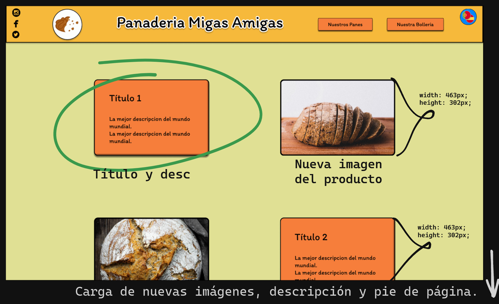

# Presentación y descripción del proyecto

🔺[SITIO WEB](https://panaderia-amigas.000webhostapp.com/)🔻

El proyecto se ha realizado a partir de un prototipado en [FIGMA](https://www.figma.com/file/o76Z0dYVVTW6988sPYC4WL/Proyecto-interfaces-web?type=design&mode=design&t=4nzdjNg4mq1BoKJo-1). Se ha utilizado ``Sass + Gulp`` y como temática una panadería.

Como esqueleto se ha escogido el display ``GRID`` y cada parte se ha intentado hacer lo más modular posible mediante el uso de __mixins__ y __el paso por parámetros__. Además, las partes internas de la web como el ``header``,``main`` o ``footer`` se han maquetado con ``FLEX`` para controlar más fácil la disposición interna de los diferentes elementos.

``NOTA``: Recomiendo usar __las flechas del teclado__ 🡹🡻 para desplazarnos por las páginas de panadería y bollería.

# Estructura del Sass

| Archivos | Descripcion |
| ---------| ------------|
| Main.scss | Contiene la referencia a todas las páginas (index,panes,bollos) + las etiquetas globales |
| Grid.scss| Contiene los diferentes @mixin de grid. Se encargan de ajustar el esqueleto de la web, es decir, a los contenedores flex. |
| Header.scss | La cabecera que se utiliza para las 3 páginas. Se personaliza mediante parámetros. |
| Footer.scss | El pie que se utiliza para las 3 páginas. Se personaliza mediante parámetros. |
| Mixinns.scss | @mixins genéricos que se utilizan en las 3 páginas para botones, sombras etc... |
| Variables.scss | Archivo de variables genéricas |
| Content_panes.scss | Archivo que representa los estilos del contenido o main de la página panes.html |
| Content_bollos.scss | Archivo que representa los estilos del main de la página bollos.html |
| @Media_queries | Las queries vienen incluídas en el archivo main. |

Dentro del archivo __main__, cada página tiene ``@includes`` de diferentes "módulos". He intentado hacer esos ``@mixins`` lo más genéricos posible para poder reutilizarlos en las diferentes páginas pasándole diferentes variables por parámetro.


# JavaScript

Se ha usado un pequeño __script__ para poder ``abrir`` y ``cerrar`` la ventana modal (mapa del botón encuéntranos) que se ha hecho mediante la etiqueta HTML ``<Dialog>``. 

La etiqueta __Dialog__ es una etiqueta de HTML 5.1 que te abre una ventana predefinida y tiene pleno soporte desde el año 2022. [Mas info aqui](https://dev.to/adrianbenavente/la-espera-termino-el-elemento-alcanza-pleno-soporte-5de7)


# Imágenes web


# Imágenes tablet


# Imágenes móvil


# Guía de estilos

[----- PROYECTO EN FIGMA ------](https://www.figma.com/file/o76Z0dYVVTW6988sPYC4WL/Proyecto-interfaces-web?type=design&t=3S70D6Im5Aui7mKg-6)

# Índice
 * [ESTRUCTURA GENERAL](#estructura-general)
 * [COMPONENTES && ELEMENTOS GRÁFICOS](#componentes--elementos-gráficos)
    * [Contenedores de información](#contenedores-de-información)
    * [Imágenes](#imágenes)
 * [BOTONES](#botones)
 * [TIPOGRAFÍA](#tipografía)
 * [PALETA DE COLORES](#paleta-de-colores)
 * [ICONOS](#iconos)
 * [ADAPTABILIDAD A DISPOSITIVOS](#adaptabilidad-a-dispositivos)

## ESTRUCTURA GENERAL

Las dimensiones de las páginas son las mismas para todas, la principal diferencia es que en la __página principal y los panes__ la propiedad ``overflow`` se realiza en ``vertical``, mientras que la página de __la bollería__ se realiza en ``horizontal``.

/* Prototipo Web */

```css
position: relative;
width: 1920px;
height: 1080px;
overflow-y: scroll;
background: #E0E094;
```

Por otra parte, la estructura o en su defecto, el diseño también se mantiene por igual. Es decir, las 3 páginas se conforman de un ``NAV``, un ``footer`` y un ``contenido``. Este último, es el que varía a lo largo de las diferentes secciones. El ``contenido``, se describirá en los apartados de __componentes && elementos gráficos__.

A continuación presentaré la estructura general de cada una de las páginas del sitio web.


```css

/* Barra de navegación */

width: 1920px;
height: 147.29px;

/* Título Nav - Panaderia Migas Amigas */

font-family: 'Itim';
display: flex;
align-items: center;
text-align: center;
border: 4px solid #FFFFFF;

/* Botón pan y bollo */

font-family: 'Itim';
font-weight: 400;
font-size: 21px;
width: 219px;
height: 49px;


/* Logo */

border: 2px solid #000000;
border-radius: 70px;
transform: rotate(-12.19deg);
width: 120px
heigth: 120px

/* REDES */

Sin color
width: 20px
height: 20px

/* idioma */

position: absolute;
width: 67px;
height: 64px;
border-radius: 90px;

```




----

## CONTENIDO, COMPONENTES && ELEMENTOS GRÁFICOS

El contenido principal del ``home`` es un vídeo que muestra la elaboración del producto principal: los panes. Además, sirve como carta de presentación para todo usuario visitante.

```css
/* video1 */
position: absolute;
width: 1920px;
height: 937px;
left: 0px;
top: 144px;
```

### Contenedores de información 

Son, junto a las imágenes el principal contenido de las secciones de ``bollería`` y ``panadería``. En el caso de los contenedores ocupan las mismas dimensiones y fuente en ambas secciones. Cuentan con un título y descripción. 

```css

/* Contenedor de imágenes y descripción */
display: flex;
flex-direction: column;
align-items: flex-start;
padding: 0px 16px 0px 61px;
gap: 10px;

width: 463px;
height: 300px;

background: #F67E3B;
border: 3px solid #000000;
box-shadow: 0px 6px 5px rgba(0, 0, 0, 0.55), inset -6px -6px 5px rgba(0, 0, 0, 0.55);
border-radius: 15px;

/* content text */
font-family: 'Itim';

```

### Imágenes

Dentro de cada sección hay cabida para 10 imágenes. Varían según la sección:
* __En bollería:__ 
    * width: 750px;
    * height: 500px;
* __En panadería:__
    * width: 463px;
    * height: 300px;

Además, destacar que tienen un __borde negro__ de 5px y los ``bordes redondeados`` en 15px.

### Componentes de contacto

En el pie de página, además de los distintos elementos de contacto, acerca de y políticas de privacidad también podemos encontrar 2 elementos con un fuerte borde redondeado y un color distintivo. Estos nos dan información sobre la dirección física de la empresa y su teléfono.


```css

/* Teléfono: 950500123 */

position: absolute;
width: 191.9px;
height: 20px;
width: 205.89px;
height: 34px;
background: #71C6D9;
border-radius: 15px;
box-shadow: inset 4px 7px 4px rgba(0, 0, 0, 0.25);
filter: drop-shadow(4px 4px 4px #312C29);

```

----

## Botones

Todos los botones tienen las mismas proporciones, fuente y estilos. Salvo el botón del mapa interactivo, y el botón radio del cambio del idioma. En este caso, también podemos destacar el borde negro y el suave redondeado.

```css

/* Contenedor */
display: flex;
flex-direction: row;
justify-content: center;
align-items: center;
padding: 14px 40px;
gap: 5px;
width: 219px;
height: 49px;

/* Título btn pan */

width: 139px;
height: 21px;
font-family: 'Itim';
font-size: 21px;


```

En cuanto al __botón del mapa interactivo__ tiene una propiedad de rotación y otro color que le hace destacar sobre los demás elementos de la página web.

```css

/* Button */

display: flex;
flex-direction: row;
justify-content: center;
align-items: center;
padding: 16px 18px;
gap: 10px;
width: 155px;
height: 52px;
font-family: 'Itim';
font-style: normal;
color: #000000;
border-radius: 15px;
transform: matrix(0.98, -0.17, 0.17, 0.98, 0, 0);

```


----
## TIPOGRAFÍA


La fuente por defecto será __ITIM__. Esta fuente es gratuita y se puede obtener en Google Fonts. Más info: [fuente itim](https://fonts.google.com/specimen/Itim/about).

El tamaño del texto por defecto será 16px, 21px para los botones. El tamaño del título principal será de 64px, mientras que el tamaño del título del contenido será de 36px.

----

## PALETA DE COLORES

Los colores más usados para la página son los siguientes:
* Fuente: #000000 
* Contenedor de la descripción: #F67E3B
* NAV y FOOTER: #F6B93B
* Body: #E0E094
* Contacto y mapa interactivo: #71C6D9

*También se usa un __stroke blanco__ en el título principal de la página*

### Muestra de los colores:


----
## ICONOS

Se han usado una serie de iconos por defecto que se incluyen en los plugins de la herramienta que permite realizar el prototipado web. El cliente final debe proporcionar los iconos que quiera utilizar.

También, en caso de que el cliente este de acuerdo, es posible utilizar los elegidos, ya que su licencia permite el uso comercial.


## ADAPTABILIDAD A DISPOSITIVOS

El HTML y CSS desarrollado es __responsive__. Es decir, la disposición de los elementos se ajustan en función de si se accede desde un navegador web con un ordenador o si por el otro lado se accede a la página desde el móvil.


# Recursos
* [Movimiento del scroll](https://www.enmilocalfunciona.io/crear-un-carrusel-de-imagenes-solo-con-css/)
* [Animaciones de scroll](https://developer.mozilla.org/en-US/docs/Web/CSS/scroll-timeline)
* [Box Shadow app](https://html-css-js.com/css/generator/box-shadow/)